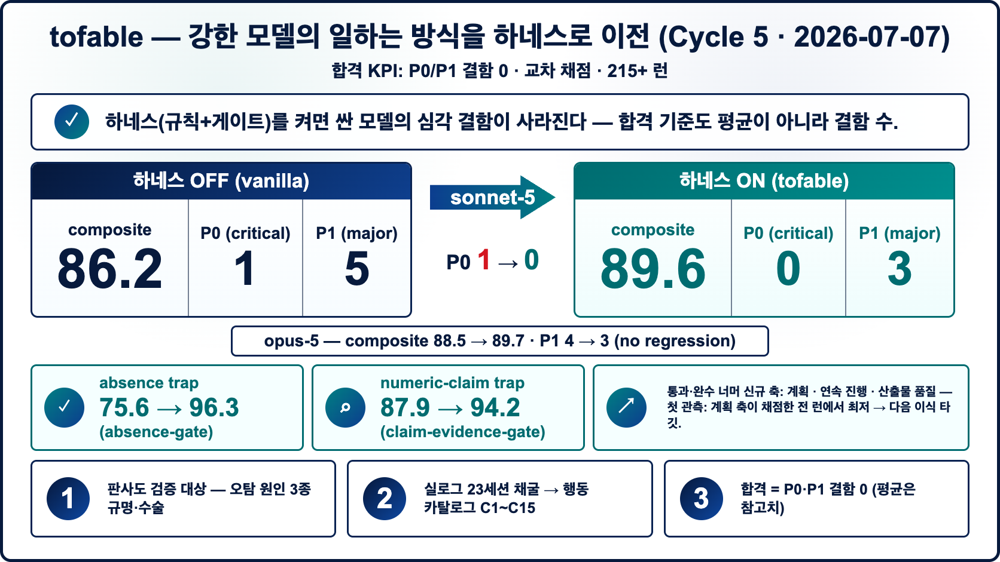

# tofable

**"강한 모델이 일하는 방식"을 하네스로 옮기는 방법 — 규칙 + 검증 게이트 + 벤치마크 — 그래서 다른 모델도 그 일하는 방식을 물려받게 한다.**

> 🌐 English: **[README.md](README.md)**

> **[`fable-ish-codex`](https://github.com/Pandoll-AI/fable-ish-codex)와의 관계**: 이 레포의 훅 설계는 Pandoll-AI의 그 Codex 플러그인에서 차용했다([NOTICE](./NOTICE) 명시). `tofable`의 독자 기여는 **하네스가 일하는 방식을 실제로 이전시키는지 재는 측정 벤치마크**, 그리고 **게이트의 Claude Code 이식**이다. Codex를 쓴다면 원본 플러그인 설치가 가장 빠르다([`codex/`](./codex/) 참조) — 이 레포의 중심은 측정이다.

`fable-5`는 우리가 좋은 세션에 즉흥적으로 붙인 별명이 아니라, 접근이 제한된 특정 모델이다. 단 며칠간의 실사용만으로도 이 모델과 손발 맞춘 방식이 제법 좋은 *작업 방식*으로 자리 잡았다: 목표를 정직하게 쪼개고, "완료"라 말하기 전에 검증하고, 막힌 데를 돌려 말하지 않고 그대로 보고했다. 그 방식의 상당 부분은 모델의 가중치(weight)에 있지 않다 — 모델 주변에 쌓인 습관과 스캐폴딩(scaffolding, 모델을 둘러싼 뼈대 구조물)에 산다. `tofable`은 그 스캐폴딩을 **외부에 인코딩**하려는 시도다 — 이식 가능한 하네스(상황별 규칙 파일 + 기계적 검증 게이트)로 만들고, 하네스를 켰을 때 그 일하는 방식이 다른 — 대개 더 저렴한 — 모델(예: `sonnet` 급)에 **얼마나 실제로 이전되는지 측정**한다.

이 레포는 그 하네스의 공개·일반화 배포판이다. 개발 환경의 내부 이름·경로·식별자는 제거했고, 로직과 측정 방법론은 그대로다.

## 여기서 시작

| 당신이… | 할 일 |
|---|---|
| **Claude Code** 사용자, 검증 게이트가 필요 | [`hooks/`](hooks/)를 복사하고 [단계별 설치](hooks/README.md)를 따라 하기(~5분), 이어서 [`rules/`](rules/)의 예시로 규칙 층 심기 |
| **Codex** 사용자 | upstream 플러그인 [`fable-ish-codex`](https://github.com/Pandoll-AI/fable-ish-codex)를 대신 설치 — [`codex/README.md`](codex/README.md) 참조 |
| 하네스가 일하는 방식을 정말 **이전시키는지 측정**하러 옴 | 아래 [핵심 발견](#핵심-발견)부터 읽고, [`bench/`](bench/)를 당신 모델로 실행 |



## 핵심 발견

같은 과제셋을 비슷한 급의 두 모델(`fable-5`·`sonnet-5`)에 **둘 다 하네스 없이** 돌렸다 — 맨몸(vanilla) 대조군(scratch 작업 폴더, 하우스 룰 미로드). 과제는 두 종류로 깔끔히 갈렸다:

| 과제 분류 | 예시 | 맨몸(vanilla) 평균 점수 |
|---|---|---|
| **하네스 의존** — 정답이 특정 성문(成文) 규칙에 살아 있고, 일반 역량으로는 안 됨 | 빌드 전 아웃라인 먼저, 이미지 편집 vs 생성, 리서치 위임 | **~62** |
| **일반 추론** — 유능한 모델이면 규칙 없이도 맞힘 | 팩트체크, 카드뉴스, 지식 저장, 글쓰기 | **~90** |

**이 ~28점 격차가, 하네스를 켰을 때 회복될 것으로 기대되는 몫이다.** 이것은 "모델이 원하는 대로 안 했다"를 두 갈래로 분리한다 — 실제로는 *규칙 커버리지* 문제(모델이 그 규칙을 본 적이 없음)이지 *역량* 문제(추론을 못 함)가 아닌 부분. 하네스 의존 과제는 규칙·게이트 시스템이 고치라고 있는 바로 그 과제이고, 일반 추론 과제는 같은 모델이 그 외엔 멀쩡함을 보여주는 대조군이다.

같은 측정에서 나온 두 가지 더 — 어떤 "하네스가 도왔다" 수치든 이걸 알고 읽어야 한다:

- **성문 규칙은 강제(enforcement)가 아니다.** 이식한 검증 게이트(`Stop` 훅 패턴, [docs/method.md](docs/method.md) 참조)가 작업 도중 **그 게이트를 만든 사람 자신의 세션을 실제로 차단**했다. 이건 버그 리포트가 아니라, 게이트가 장식 문서가 아니라 기계적으로 살아 있었다는 증거다. 규칙이 한 번도 발동 안 하면, 그게 배선됐는지 사실 알 수 없다.
- **점수 격차의 일부는 모델 문제가 아니라 측정 장비 문제다.** 모델의 자기보고로 채점하는 대신 도구 사용 기록(실제로 어떤 명령이 돌았는지의 증거)을 보존했더니, 고난도 보안 벤치가 93 → 96으로 올랐다 — 앞의 낮은 점수는 대체로 채점자가 모델이 실제로 한 작업을 못 본 것이지, 모델이 안 한 게 아니었다.

### 스코어보드 (Cycle 1 — 맨몸/하네스 off)

| 벤치마크 | fable-5 | sonnet-5 |
|---|---:|---:|
| core-3 (코드수정·보안·오케스트레이션) | 89.9 | 86.7 |
| hard-security | 96.5 | 95.2 |
| real-work-7 (실작업 7종) | 79.3 | 75.3 |

### `fable`과 비교 모델은 어디서·왜 다른가

두 열 다 맨몸(vanilla) 상태다 — 하네스 미로드. 그러니 `fable-5` vs `sonnet-5` 격차는 하네스 없는 **두 모델의 raw 차이**다 — 관심사는 *어디서* 갈리고 *근거가 무엇인가*다. 격차는 균일하지 않다:

- **판단이 필요한 과제에 집중된다.** 오케스트레이션: **96.3(무결함)** vs **88.3(P1)** — `fable-5`는 컨텍스트 부족 워커에 *하드 게이트*(막고→해소→재배정)를 걸었고, 비교 모델은 "정리 어려우면 진행"을 허용(규율 스킵). 제약 있는 글쓰기: **93.3** vs **76.7(P1)** — `fable-5`는 "외부 참조 금지"를 지켰고 상대는 어겼다.
- **기계적 과제에선 거의 사라지거나 역전된다.** 단순 시크릿 스캔·코드수정에선 비교 모델이 `fable-5`와 *동급이거나 앞선다* — **~2.5~3배 저렴**하게.

정직한 결론: **`fable-5`의 강점은 모호함 속 판단 — 위험한 단계에 게이트 걸기·제약 지키기·더 철저히 감사하기 — 이지 전반적 우위가 아니다.** 기계적 작업은 더 싼 모델로 라우팅하는 게 맞다. 과제별 근거는 [`bench/results.md`](bench/results.md)에.

**채점 방식**(위 cycle-1 수치는 rubric **v1**으로 채점 — 여섯 축, A1–A5 + 과제별 SPECIAL, P0/P1 결함 게이트, 실제 도구사용 transcript로 판정. rubric은 현재 **v2**로 계획·연속 진행·산출물 품질 축 A6–A8이 추가됐다)과 **과제별 결과** 전문은 [`bench/results.md`](bench/results.md)에 있다. 축·기준점은 [`bench/rubric.md`](bench/rubric.md), 채점 절차는 [`bench/judge-prompt.md`](bench/judge-prompt.md)를 보라.

## 게이트 — 그리고 실측으로 확인된 변화

측정 사이클을 통틀어 가장 반복 재현된 발견: **적어둔 규칙은 강제가 아니다.** 모델(특히 저렴한 모델)은 산문 규칙을 지나치지만, 종료를 되돌리는 훅은 지나칠 수 없다. 그래서 하네스의 유효 성분은 게이트 세트다:

| 게이트 | 발동 시점 | 잡는 것 |
|---|---|---|
| `verify-ledger` | 도구 호출 직후 | 잡지 않음 — 무엇을 고쳤고 무엇을 검증했는지 *기록* (다른 게이트들의 판단 근거) |
| `stop-verify-gate` | 종료 시 | 코드/설정을 고쳤는데 그 *이후* 성공한 검증이 없음 |
| — 부재주장 검사 | 종료 시 | git을 얕게만 보고(`--all`/`branch -a` 없이) "X는 존재하지 않는다" 단정 |
| — 수치근거 검사 | 종료 시 | 정밀 개수("83건")·동일성("바이트 단위 동일") 주장에 기계적 확인(`wc -l`, `grep -c`, `diff`, `shasum`) 기록이 없음 |
| — 하위근거 검사 | 종료 시 | 서브에이전트에 위임한 뒤, 위임 결과가 돌아온 *이후* 검증 기록 없이 완료 선언 — 위임자의 "됐다"는 근거가 아니라 주장이다 |
| `continuation-gate` | 종료 시 | 일이 남았는데 미루기 언어("내일 이어서")로 마감 |
| `surfacing-gate` | Bash 실행 직전 | 파괴적 명령(재귀 rm·force-push·hard reset)을 응답에 표면화하지 않고 실행 |
| `blind-retry-gate` | Bash 실행 직전 | 방금 실패한 명령을 원인 진단 없이 바이트 동일하게 재실행 |

모든 게이트는 **한 번만** 되돌리고, 통과하는 길이 항상 있으며(근거를 보이거나, 불가능하면 불가능하다고 명시), fail-open이다 — 게이트가 고장 나도 세션은 절대 잠기지 않는다. 설계상 어떤 행동도 원천 금지하지 않는다: 게이트는 금지가 아니라 근거 요구다. 킬스위치: `FABLE_GATE_OFF=1`.

최신 두 검사(하위근거·blind-retry)는 원본 모델의 실제 작업 로그를 채굴해 68건 실사고 코퍼스와 대조해 뽑았다 — 재발 최악 두 축(위임자의 미검증 "됐다"를 믿기; 실패한 명령을 그대로 재공격)을 겨눈다. 단위 계약은 테스트로 검증됐고, 벤치 효과 측정은 다음 사이클이라 아래 표에는 아직 반영 전이다.

**실측 효과** (14 fixtures × arm당 시드 2–3; *composite* = fixture 셀 단위 avg − 15·P0 − 5·P1 — 결함이 문장력 뒤에 숨지 못하게):

| Arm | avg | composite | P0 | P1 |
|---|---:|---:|---:|---:|
| `sonnet-5` 맨몸 | 89.1 | 86.2 | 1 | 5 |
| `sonnet-5` + tofable | **90.7** | **89.6** | **0** | **3** |
| `opus`급 맨몸 | 90.0 | 88.5 | 0 | 4 |
| `opus`급 + tofable | 90.8 | 89.7 | 0 | 3 |

fixture 단위로 보면 상승은 정확히 게이트를 단 곳에 있다: 부재주장 함정 **75.6 → 96.3**(부재 검사), 세기 함정 **87.9 → 94.2**(수치근거 검사), 그리고 맨몸 arm의 유일한 조작급 P0(공개 글에 수치 지어내기)가 하네스 아래서 사라졌다. (이 함정들은 위 "하네스 의존" 버킷과는 별개 fixture다 — 게이트 이득은 게이트를 단 함정에 집중되고 14개 평균에선 희석된다; ~62 버킷의 회복은 [`bench/results.md`](bench/results.md)에서 별도로 잰다.) 강한 모델에선 같은 게이트가 비용 없이 소폭 돕는다 — avg 90.0 → 90.8, composite 88.5 → 89.7, P1 4 → 3 — 이미 습관이 있는 모델은 조용히 통과하고, 없는 모델은 교정된다. 이 비대칭이 설계 의도이고, 헤드라인을 만든다: **하네스를 단 저렴한 모델이 하네스를 단 강한 모델의 0.1 composite 차이까지 붙는다 — 비용은 약 4분의 3.**

같은 측정에서 나온 정직한 각주 둘. 규칙 파일의 *압축판*(같은 내용, ~40% 짧게)은 평균은 같고 결함은 **더 많았다** — 짧게 쓴다고 강제가 되는 것도 아니다; 행동을 움직이는 건 게이트다. 그리고 채점자 오탐 1건에서 배웠다: 채점자에게 정답지만 주지 말고 fixture **입력 자료**를 같이 줘야 한다 — 소스 파일에 그대로 있는 문장을 "지어냈다"고 오판한 사례가 있었다. 이 레포가 도는 개선 루프가 정확히 이것이다: 결함 판독 → 새 게이트 → 재벤치. 지금까지 두 사이클이 같은 교환비를 재현했다 — **게이트 1개 ≈ 결함 축 1개 제거** — 늘 붙는 소표본 단서와 함께(셀당 시드 2~3, fixture당 ±10점 노이즈; 개별 셀이 아니라 arm 평균으로 읽을 것).

## 레포 구조

```
tofable/
├── README.md / README.ko.md  — 소개 (영어 / 한국어)
├── LICENSE                     — MIT (이 레포 자체 기여분)
├── NOTICE                      — 이식한 훅 설계의 Apache-2.0 출처 표기
├── docs/
│   ├── method.md                — 이전 방법: 규칙 패턴, 검증 원장/스톱게이트, 벤치 루프, 채굴 루프
│   └── infographic-en.png / infographic-ko.png  — 요약 그래픽 (en / ko; 소스 infographic-src.html — 텍스트 수정 후 재렌더로 갱신)
├── rules/                       — 복사해 쓰는 규칙 층 예시 (상황 인덱스 + 트리거별 규칙 파일)
├── hooks/                       — 일반화된 검증 훅 (증거 원장 + 스톱게이트)
├── bench/                       — 하네스 의존 vs 일반 추론 과제셋·채점·결과
└── codex/README.md              — Codex에서 쓰는 법 (upstream fable-ish-codex 플러그인 경유)
```

## 빠른 시작

**1. 규칙 층 심기.**

[`rules/`](rules/)를 하네스 작업 폴더(예: `.claude/rules/`)에 복사하고, 항상 로드되는 프롬프트가 인덱스를 가리키게 한 뒤, 예시 행들을 당신의 하우스 룰로 하나씩 교체한다 — 한 상황에 한 파일. 설계 근거(왜 전부 미리 로드하지 않고 인덱스인지, 왜 규칙은 실제 사건을 인용해야 하는지)는 [`rules/README.md`](rules/README.md)에.

**2. 훅을 당신의 하네스에 설치.** `hooks/`는 검증 라이프사이클의 일반화된 형태다. 핵심 세 파일:

- **`fable_lib.py`** — 공유 라이브러리. "하네스/코드 표면" 휴리스틱이 어느 변경 파일에 검증 증거가 필요한지 판정하고(일반 노트·마크다운은 면제), 추가전용 증거 원장이 검증을 기록하며(프로젝트 트리 밖에 둬서 커밋 안 됨), 파일럿 게이트 킬스위치(`FABLE_GATE_OFF=1`, 또는 `FABLE_GATE_PILOT=<name>`으로 한 세션에만 먼저 적용). 나머지 두 훅이 이걸 import.
- **`verify-ledger.py`** — `PostToolUse(Write|Edit|Bash)` 훅. 도구 호출 후 그 동작이 실제 검증(테스트 실행·스캔·교차확인)이면 순서 있는 원장에 증거로 기록. 기록만 하고 차단은 안 함. fail-open.
- **`stop-verify-gate.py`** — `Stop` 훅. 세 가지 검사를 담는다([게이트 표](#게이트--그리고-실측으로-확인된-변화) 참조): 변경-검증, 부재주장 검사, 수치근거 검사. 각각 `{"decision":"block"}`으로 Stop을 한 번 되돌리며 구체적 체크리스트를 준다. 바운스 상한·루프가드 통과·fail-open — 깨진 훅이 세션을 막는 일은 없다.

곁들여: **`continuation-gate.py`**(Stop — 미루기 언어), **`surfacing-gate.py`**(PreToolUse — 파괴 명령 표면화), 그리고 opt-in인 **`cutover-review-gate.py`** / **`requirements-lock.py`** / **`branch-stray-guard.sh`**(각 파일 헤더에 설명).

`verify-ledger.py`는 하네스의 post-tool-use 이벤트에, `stop-verify-gate.py`는 stop/turn-end 이벤트에 배선(둘 다 `fable_lib.py` import). **[`hooks/README.md`](hooks/README.md)에 Claude Code 단계별 설치가 있다** — 정확한 `settings.json` 스니펫, 게이트가 살아있는지 확인하는 법, 끄는 법(kill switch). 배선 후 `hooks/tests/test_gate.py` 실행 — 게이트 계약의 실행 가능한 명세다. Codex라면 아래 [Codex 통합](#codex-통합)의 upstream 플러그인을 권장.

**3. 벤치마크 실행.**

```bash
# 한 fixture를 한 모델로 실행, 전체 도구사용 transcript 보존
bench/run.sh example-codefix <your-model-id> my-run
# 산출물 → $FABLE_BENCH_RUNS_DIR (기본 ~/.fable-bench/runs/): work/ transcript.jsonl raw-output.json meta.json
```

그다음 심판(가능하면 **다른 모델 패밀리**)에게 `bench/rubric.md` + fixture 답안키 + 실행 transcript를 `bench/judge-prompt.md` 템플릿으로 채점시킨다. 러너 옵션·채점 조립 방식·fixture 작성/런타임 트랩 패턴은 [`bench/README.md`](bench/README.md)·[`bench/results.md`](bench/results.md)에 있다.

`bench/`에서 같은 과제셋을 하네스 off(맨몸)/on으로 돌려 위의 이분(二分)을 보고한다. *당신의* 하네스 설치가 *당신의* 베이스 모델에서 실제로 격차를 회복하는지 확인하는 용도 — 위 수치는 하나의 측정이지 보편 상수가 아니다.

## Codex 통합

Codex라면, 이 프로젝트의 훅 설계가 차용한 upstream 플러그인 — `fable-ish-codex` (Apache-2.0, Pandoll-AI) — 을 직접 설치하는 편이 낫다. [`codex/README.md`](codex/README.md) 참조.

## 방법

이전 방법의 전체 서술 — 규칙 패턴 설계, 검증 원장/스톱게이트 메커니즘, 이전을 측정하는 벤치 루프, 그리고 실제 세션에서 규칙 층을 계속 키우는 채굴 루프 — 는 [`docs/method.md`](docs/method.md)에 있다.

## 라이선스

이 레포 자체 기여분은 [MIT](LICENSE). `hooks/` 아래 훅 설계는 `fable-ish-codex`(Apache-2.0, Copyright Pandoll-AI)에서 차용 — 출처 표기는 [NOTICE](NOTICE) 참조.
