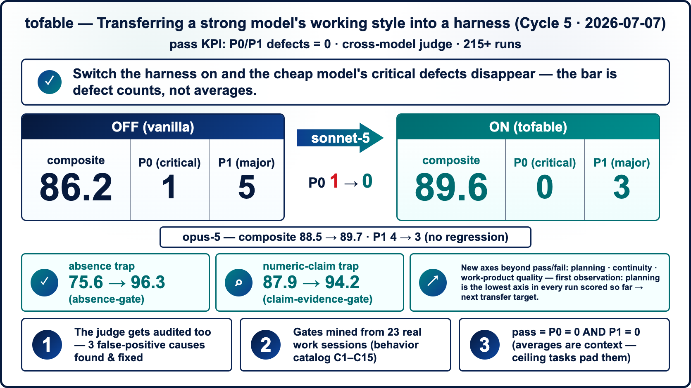

# tofable

> 🇰🇷 **한국어 버전: [README.ko.md](README.ko.md)**

**A method for transferring "how a strong model works" into a harness — rules + verification gates + a benchmark — so other models inherit the working style.**

> **How this relates to [`fable-ish-codex`](https://github.com/Pandoll-AI/fable-ish-codex):** the hook design here is borrowed from that Codex plugin by Pandoll-AI (credited in [NOTICE](./NOTICE)). What `tofable` contributes on its own: **the benchmark that measures whether the harness actually transfers the working style**, and **a Claude Code port of the gates**. On Codex? The fastest path is to install the original plugin (see [`codex/`](./codex/)) — this repo is where the measurement lives.

`fable-5` here is a specific, limited-availability model — not a nickname we coined for a good run. Even over just a few days of real use, the way we worked with it settled into a genuinely good *working style*: goals decomposed honestly, work verified before "done" was claimed, blockers reported plainly instead of narrated around. Much of that style isn't in the model's weights — it lives in the habits and scaffolding built up around the model. `tofable` is an attempt to encode that scaffolding externally, as a portable harness (situational rule files + mechanical verification gates), and then **measure** how much of the working style actually transfers to other — often cheaper — models (e.g. a `sonnet`-class model) once the harness is switched on.

This repo is the public, generalized distribution of that harness. Internal names, paths, and identifiers from the environment it was developed in have been stripped; the logic and the measurement methodology have not.

## Start here

| You are… | Do this |
|---|---|
| on **Claude Code**, want the verification gate | copy [`hooks/`](hooks/) and follow the [step-by-step install](hooks/README.md) (~5 min), then seed your rule layer from the examples in [`rules/`](rules/) |
| on **Codex** | install the upstream plugin [`fable-ish-codex`](https://github.com/Pandoll-AI/fable-ish-codex) instead — see [`codex/README.md`](codex/README.md) |
| here to **measure** whether a harness actually transfers a working style | start at [Key finding](#key-finding) below, then run [`bench/`](bench/) against your own model |



## Key finding

We ran the same task set on two comparable models (`fable-5` and `sonnet-5`), **both without the harness** — a vanilla control arm (a scratch working dir where the house rules aren't loaded). The tasks split cleanly into two kinds:

| Task category | Example tasks | Vanilla avg score |
|---|---|---|
| **Harness-dependent** — the correct answer lives in a specific written house rule, not in general competence | deck-outline-before-build, image-edit-vs-generate, research-delegation | **~62** |
| **General-reasoning** — competent models get these right regardless of house rules | fact-check, cardnews, knowledge-save, writing | **~90** |

**The ~28-point gap is what turning the harness ON is expected to recover.** It isolates the part of "the model didn't do what we wanted" that is actually an *instruction-coverage* problem (the model never saw the rule) rather than a *capability* problem (the model can't reason well enough). Harness-dependent tasks are exactly the ones a rules-and-gates system is supposed to fix; general-reasoning tasks are a control group showing the same model is otherwise fine.

Two more findings from the same measurement pass, because they change how you should read any "harness helped" number:

- **A written rule is not enforcement.** The ported verification gate (the `Stop`-hook pattern described in [docs/method.md](docs/method.md)) actually blocked its own author's session mid-task. That's not a bug report — it's the proof that the gate was mechanically live rather than decorative documentation. If a rule never fires, you don't actually know it's wired in.
- **Some of the score gap is an instrument gap, not a model gap.** Simply preserving tool-use transcripts (evidence of what commands actually ran) instead of grading on the model's self-report raised the hard-security benchmark from 93 to 96 — the earlier lower score was largely the grader being unable to see work the model had actually done, not the model failing to do it.

### Scoreboard (Cycle 1 — vanilla / harness off)

| Benchmark | fable-5 | sonnet-5 |
|---|---:|---:|
| core-3 | 89.9 | 86.7 |
| hard-security | 96.5 | 95.2 |
| real-work-7 | 79.3 | 75.3 |

### Where `fable` and a comparable model differ — and why

Both columns are the vanilla arm (no harness loaded), so the `fable-5` vs `sonnet-5` gap here is the two models' *raw* difference, before any harness — the useful question is *where* they diverge and *on what evidence*. The gap is not uniform:

- **It concentrates in judgment-heavy tasks.** Orchestration: **96.3 (clean)** vs **88.3 (P1)** — `fable-5` put a *hard gate* on a low-context worker (block-until-resolved + reassign) where the comparable model allowed "proceed if cleanup is hard," a skipped discipline. Constrained writing: **93.3** vs **76.7 (P1)** — `fable-5` honored a "no outside references" rule the other broke.
- **It nearly vanishes or reverses on mechanical tasks.** On plain secret-scan and code-fix, the comparable model *ties or beats* `fable-5` — at **~2.5–3× lower cost**.

The honest, evidence-backed read: **`fable-5`'s edge is judgment under ambiguity — gating a risky step, honoring a constraint, auditing more thoroughly — not a uniform lift.** You'd route mechanical work to the cheaper model. Per-task evidence for every one of these claims is in [`bench/results.md`](bench/results.md).

**How scoring works** (the cycle-1 numbers above were scored under rubric v1 — six axes, A1–A5 plus a task-specific SPECIAL, with P0/P1 defect gates, judged on the actual tool-use transcript; the rubric is now **v2**, adding process axes A6–A8 for planning/continuity/work-product quality) and the full **per-task results** are in [`bench/results.md`](bench/results.md); the axes/anchors are in [`bench/rubric.md`](bench/rubric.md) and the judging procedure in [`bench/judge-prompt.md`](bench/judge-prompt.md).

## The gates — and what they measurably change

The single most reproduced finding across our measurement cycles: **a written rule is not enforcement.** Models (especially cheaper ones) skim past prose rules, but they cannot skim past a hook that bounces their Stop. So the harness's active ingredient is the gate set:

| Gate | Fires | Catches |
|---|---|---|
| `verify-ledger` | after every tool call | nothing — it *records* what changed and what was verified (the evidence the other gates judge) |
| `stop-verify-gate` | on Stop | code/config changed, but no successful verification ran *after* the change |
| — absence check | on Stop | "X doesn't exist" claimed after consulting git shallowly (no `--all` / `branch -a` boundary expansion) |
| — claim-evidence check | on Stop | a precise count ("83 messages") or an identity claim ("byte-for-byte identical") with no mechanical check (`wc -l`, `grep -c`, `diff`, `shasum`) in the tool log |
| — subordinate-evidence check | on Stop | completion declared after delegating to a subagent, with no verification recorded *after* the delegate returned — a delegate's "done" is a claim, not evidence |
| `continuation-gate` | on Stop | deferral language ("I'll continue tomorrow") while work remains and nothing is user-blocked |
| `surfacing-gate` | before Bash | destructive commands (recursive rm, force-push, hard reset) about to run without being surfaced in the response first |
| `blind-retry-gate` | before Bash | re-running the byte-identical command that just failed, with no diagnosis step in between |

Every gate bounces **once**, always has a path through (show the evidence, or state explicitly why it's impossible), and fails open — a broken gate never wedges a session. Nothing is hard-forbidden by design: gates demand evidence, they don't ban actions. Kill switch: `FABLE_GATE_OFF=1`.

The two newest checks (subordinate-evidence, blind-retry) were mined from the source model's actual work logs cross-referenced against a 68-incident failure corpus — they cover the two worst-recurrence axes (trusting a delegate's unverified "done"; re-attacking an error with the identical command). Their unit contracts are tested; their bench effect is the next measurement cycle, so the table below does not include them yet.

**Measured effect** (14 fixtures × 2–3 seeds per arm; *composite* = avg − 15·P0 − 5·P1 per fixture cell, so defects can't hide behind style points):

| Arm | avg | composite | P0 | P1 |
|---|---:|---:|---:|---:|
| `sonnet-5` vanilla | 89.1 | 86.2 | 1 | 5 |
| `sonnet-5` + tofable | **90.7** | **89.6** | **0** | **3** |
| `opus`-class vanilla | 90.0 | 88.5 | 0 | 4 |
| `opus`-class + tofable | 90.8 | 89.7 | 0 | 3 |

Fixture-level, the gains sit exactly where a gate was added: the absence-claim trap went **75.6 → 96.3** (absence check), the counting trap **87.9 → 94.2** (claim-evidence check), and the vanilla arm's one fabrication-class P0 (inventing figures for a public post) disappeared under the harness. (These traps are separate fixtures from the harness-dependent bucket above — gate gains concentrate on the gated traps and get diluted in the 14-fixture average; recovery of the ~62 bucket is measured separately in [`bench/results.md`](bench/results.md).) On the stronger model the same gates cost nothing and help slightly — avg 90.0 → 90.8, composite 88.5 → 89.7, P1 4 → 3 — models that already have the habit pass through silently; models that don't get corrected. That asymmetry is the design intent, and it produces the headline: **the harnessed cheaper model lands within 0.1 composite of the harnessed stronger one, at roughly three-quarters of the cost.**

Two honest footnotes from the same pass. A *compact* variant of the rule files (same content, ~40% shorter) scored the same average with **more** defects — brevity is not enforcement either; the gates are what move behavior. And one judge false-positive taught us to attach fixture **input materials** to the judge, not just the answer key — a graded model was flagged for "fabricating" strings that were verbatim in its source file. The improvement loop this repo runs is exactly: defect readout → new gate → re-bench. Two cycles so far have reproduced the same exchange rate — **one gate ≈ one defect axis removed** — with the usual small-n caveat (2–3 seeds per cell, ±10-point per-fixture noise; read arm averages, not single cells).

## Repo structure

```
tofable/
├── README.md            — this file
├── LICENSE               — MIT (this repo's own contributions)
├── NOTICE                — Apache-2.0 attribution for the ported hook design
├── docs/
│   ├── method.md          — the transfer method: rule patterns, verification ledger/stop-gate, benchmark loop, mining loop
│   └── infographic-en.png / infographic-ko.png  — summary graphics (en / ko; source: infographic-src.html — edit text + re-render to refresh)
├── rules/                 — copyable example rule layer (situation index + trigger-keyed rule files)
├── hooks/                 — harness-agnostic, generalized verification hooks (evidence ledger + stop-gate)
│   ├── requirements-lock.py   — opt-in completion-bias guard (locked feature signatures must keep existing)
│   └── tests/
│       ├── replay/            — violation corpus: past gate-worthy violations replayed as fixtures (block rate + corpus floor)
│       └── probes/            — practice probes: the gate pipeline's own contracts, checked deterministically
├── bench/                 — the harness-dependent vs. general-reasoning task set, scoring, and raw results
│   └── substrate-check.sh     — one-line substrate snapshot for model-transition rehearsals (before/after delta must be 0)
└── codex/
    └── README.md          — how to use this with Codex, via the upstream fable-ish-codex plugin
```

## Quickstart

**1. Seed the rule layer.**

Copy [`rules/`](rules/) into your harness workspace (e.g. `.claude/rules/`), point your always-loaded prompt at the index, and start replacing the example rows with your own house rules — one situation per file. The design rationale (why an index instead of front-loading, why rules must cite incidents) is in [`rules/README.md`](rules/README.md).

**2. Install the hooks into your harness.**

`hooks/` is the generalized, harness-agnostic form of the verification lifecycle. The core three:

- **`fable_lib.py`** — shared library. A "harness/code surface" heuristic decides which changed files require verification evidence (plain notes/markdown are exempt); an append-only evidence ledger records verifications, git usage, and boundary-expansion evidence (kept outside the project tree so it's never committed); and a pilot-gate kill switch (`FABLE_GATE_OFF=1`, or `FABLE_GATE_PILOT=<name>` to scope the gate to one named session before enabling it broadly). The other hooks import it.
- **`verify-ledger.py`** — a `PostToolUse(Write|Edit|Bash)` hook. After a tool call, if the action is a real verification (a test run, a scan, a cross-check) it records that as evidence in an ordered ledger. It only records — never blocks. Fail-open (any exception exits cleanly).
- **`stop-verify-gate.py`** — a `Stop` hook carrying three checks (see [the gates table](#the-gates--and-what-they-measurably-change) above): change-verification, the absence-claim check, and the claim-evidence check. Each emits `{"decision":"block"}` to bounce the stop once with a concrete checklist. Capped bounces, loop-guard aware, fail-open — a broken hook never wedges a session.

Alongside them: **`continuation-gate.py`** (Stop — deferral language), **`surfacing-gate.py`** (PreToolUse — destructive-command surfacing), and the opt-in **`cutover-review-gate.py`** / **`requirements-lock.py`** / **`branch-stray-guard.sh`** described in their headers.

Wire `verify-ledger.py` into your harness's post-tool-use event and `stop-verify-gate.py` into its stop / turn-end event; both import `fable_lib.py`. **[`hooks/README.md`](hooks/README.md) has the step-by-step Claude Code install** — the exact `settings.json` snippets, how to confirm the gate is live, and the kill switch. After wiring, run `hooks/tests/test_gate.py` — it's a runnable spec of the gate's contract. Two companion suites keep the gate honest over time: `hooks/tests/replay/run.py` replays archived violation scenarios (block rate must stay 100%, and a corpus floor stops fixture-deletion from faking it), and `hooks/tests/probes/run.py` checks the pipeline's own contracts (exit-code conventions, ledger schema, escape hatches). When you switch reasoning models, `bench/substrate-check.sh` snapshots all of it in one JSON line — run it before and after; delta 0 confirms the gate mechanics (block rate, contracts, hooks) are intact across the transition — the plumbing didn't break. Behavioral transfer is what `bench/` measures. Adoption reasoning for these pieces: [docs/decision-history.md](docs/decision-history.md). If your harness is Codex specifically, see [Codex integration](#codex-integration) below — you likely want the upstream plugin instead of a manual port.

**3. Run the benchmark.**

```bash
# run one fixture against one model, preserving the full tool-use transcript
bench/run.sh example-codefix <your-model-id> my-run

# artifacts land in $FABLE_BENCH_RUNS_DIR (default ~/.fable-bench/runs/):
#   work/  transcript.jsonl  raw-output.json  meta.json
```

Then grade the run with a judge — ideally a **different model family** than the one that produced it — feeding it `bench/rubric.md` + the fixture's answer key + the run's transcript, via the template in `bench/judge-prompt.md`. Full runner options, how scoring is assembled, and the fixture-authoring / runtime-trap pattern are in [`bench/README.md`](bench/README.md) and [`bench/results.md`](bench/results.md).

The benchmark runs the same task set with the harness off (vanilla) and on, and reports the harness-dependent vs. general-reasoning split described above. Use it to check whether *your* harness install actually recovers the gap on *your* base model — the numbers above are one measurement, not a universal constant.

## Codex integration

If you're on Codex, prefer installing the upstream plugin this project's hook design was adapted from — `fable-ish-codex` (Apache-2.0, Pandoll-AI) — rather than manually porting `hooks/`. See [`codex/README.md`](codex/README.md) for install steps and how the two projects relate.

## Method

The full write-up of the transfer method — rule-pattern design, the verification ledger / stop-gate mechanism, the benchmark loop used to measure transfer, and the mining loop that keeps the rule layer growing from real sessions — is in [`docs/method.md`](docs/method.md).

## Acknowledgments

This project stands on work generously shared by others in the Korean Claude/Codex community:

- **[fablize](https://github.com/fivetaku/fablize)** by gptaku ([@gptaku_ai](https://www.threads.com/@gptaku_ai)) — a Claude Code plugin making Opus behave like Fable, with completion/evidence/verification enforced as procedure. A parallel take on the same transfer problem that sharpened ours.
- **[fable-ish-codex](https://github.com/Pandoll-AI/fable-ish-codex)** by voice / 현님 ([@voidlight00](https://www.threads.com/@voidlight00), Pandoll-AI, Apache-2.0) — the upstream this project's hook design was adapted from (see NOTICE).
- **[Hugh Kim](https://github.com/jung-wan-kim)** ([@hue_0525](https://www.threads.com/@hue_0525), [hugh-kim.space](https://hugh-kim.space)) — the fable-week series ([day 1](https://hugh-kim.space/fable-week.html), [day 2](https://hugh-kim.space/fable-week-2.html)), whose completion-gate / closed-loop / honest-measurement benchmarks this repo borrows as its evaluation frame.

Thank you — this repo would be thinner without each of you.

## License

This repository's own contributions are licensed under the [MIT License](LICENSE). The hook design under `hooks/` is adapted from `fable-ish-codex` (Apache-2.0, Copyright Pandoll-AI); see [NOTICE](NOTICE) for the required attribution.
